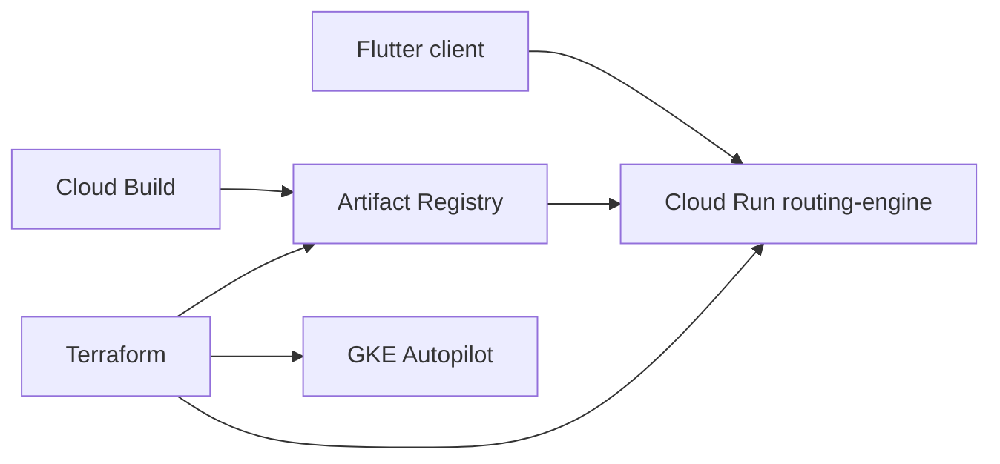

# Деплой CyberTransPay в Google Cloud

Пошаговая инструкция для **routing-engine** (Cloud Run) и инфраструктуры из `terraform/`.

## Предварительные требования

- GCP проект с включённым биллингом
- `gcloud` CLI и `terraform` >= 1.9
- Права: `roles/owner` или набор Editor + IAM admin на проект

## Быстрый путь (скрипт)

```bash
export PROJECT_ID="your-gcp-project-id"
export REGION="europe-west1"
export AUTH_API_KEYS="your-long-random-api-key"
./scripts/gcp-apply.sh
```

Скрипт установит `gcloud` (если нет), выполнит `terraform apply` и опционально Cloud Build.

## 1. Инициализация GCP

```bash
export PROJECT_ID="your-project-id"
export REGION="europe-west1"

gcloud config set project "$PROJECT_ID"
gcloud auth application-default login
```

## 2. Terraform (инфраструктура)

```bash
cd terraform
cp terraform.tfvars.example terraform.tfvars
# отредактируйте project_id и флаги

terraform init
terraform plan
terraform apply
```

После apply:

```bash
terraform output routing_engine_url
terraform output artifact_registry_docker
```

### Переменные

| Переменная | Описание |
|------------|----------|
| `allow_public_routing_api` | `true` — публичный invoke Cloud Run (без IAM GCP) |
| `auth_required` | `true` — обязательный заголовок `X-API-Key` |
| `auth_api_keys` | Ключи через запятую → Secret Manager |
| `routing_engine_image_tag` | Тег Docker-образа в Artifact Registry |

## 3. Сборка и публикация образа

### Вариант A: Cloud Build (рекомендуется)

```bash
gcloud builds submit --config=cloudbuild.yaml --project="$PROJECT_ID"
```

### Вариант B: локально

```bash
gcloud auth configure-docker "${REGION}-docker.pkg.dev"

docker build -f backend/routing-engine/Dockerfile -t \
  "${REGION}-docker.pkg.dev/${PROJECT_ID}/cybertranspay/routing-engine:latest" \
  backend

docker push "${REGION}-docker.pkg.dev/${PROJECT_ID}/cybertranspay/routing-engine:latest"

gcloud run services update routing-engine \
  --image="${REGION}-docker.pkg.dev/${PROJECT_ID}/cybertranspay/routing-engine:latest" \
  --region="$REGION"
```

## 4. Проверка API

```bash
URL=$(terraform -chdir=terraform output -raw routing_engine_url)
API_KEY="your-key-from-tfvars"

curl "$URL/health"

curl -X POST "$URL/v1/routes/quote" \
  -H "X-API-Key: ${API_KEY}" \
  -H 'Content-Type: application/json' \
  -d '{"from_asset":"USDT","to_asset":"EUR","amount":1000,"preference":"fastest"}'
```

Ответ содержит `spot_rate`, `rate_source` (`coingecko+frankfurter`) и `live_pricing: true`.

## 5. Flutter → Cloud Run

```bash
cd frontend
flutter run -d chrome \
  --dart-define=API_BASE_URL=https://routing-engine-xxxxx-ew.a.run.app \
  --dart-define=API_KEY=your-key
```

Для production используйте HTTPS URL из `routing_engine_url` и ограничьте CORS на backend (сейчас `*` — только для разработки).

## Архитектура



## Безопасность (после MVP)

- Отключите `allow_public_routing_api`, используйте IAM / API Gateway
- Ограничьте CORS конкретными доменами
- Храните секреты в Secret Manager
- Включите Cloud Armor и audit logging
